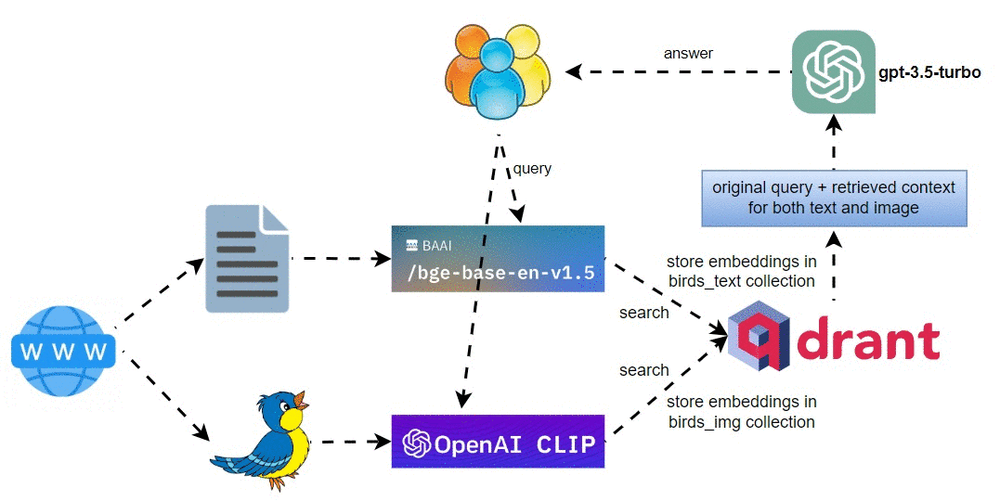

# multi_modal_retrieval_backyard_birds

A little app I created for my daughter who loves birds. :-)

Check out my Medium blog post for details. [Multimodal Retrieval with Text Embedding and CLIP Image Embedding for Backyard Birds](https://levelup.gitconnected.com/multimodal-retrieval-with-text-embedding-and-clip-image-embedding-for-backyard-birds-599f19057a70?sk=e97fccefe5cd312fa082325e5820c34d).

* Step 1: Download backyard birds text and images
* Step 2: Build text index for vector store and define text query engine
* Step 3: Build image index for vector store using OpenAI CLIP embeddings
* Step 4: Multimodal retrieval of both image and text for sample queries
